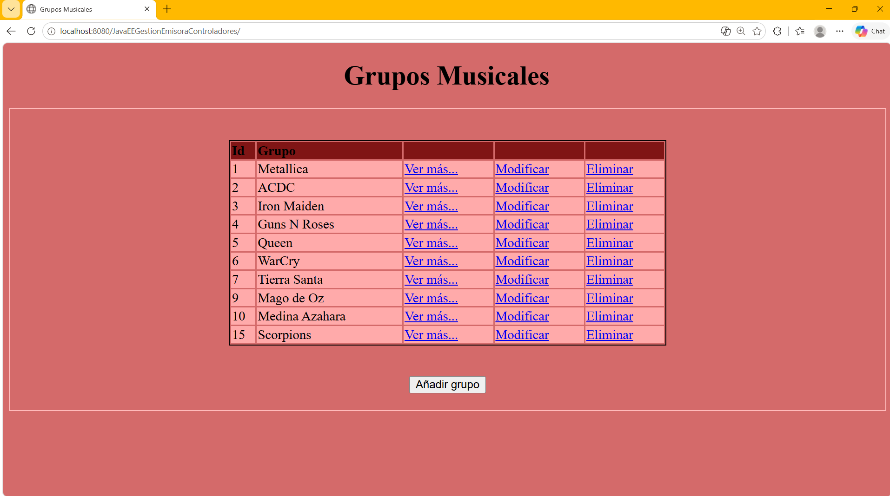
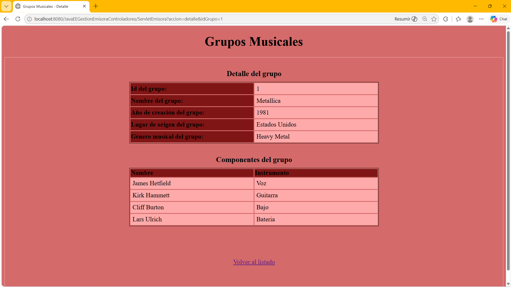
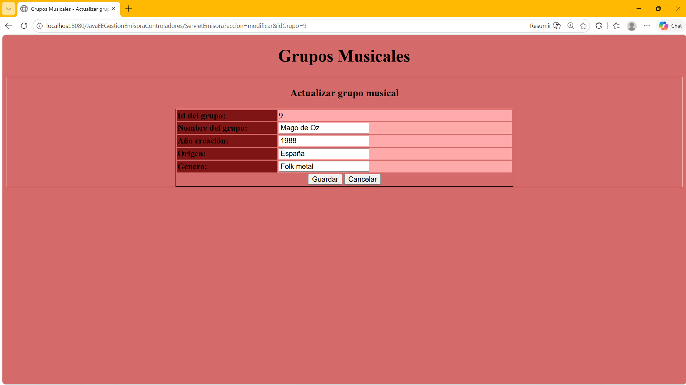
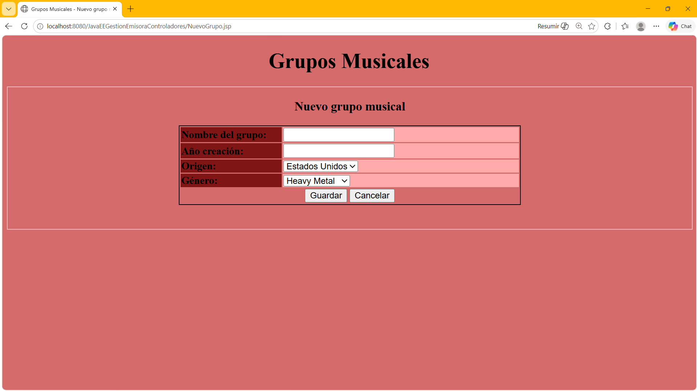

# 📻 Gestión Emisora de Radio — Java EE
<p align="center">
  
</p>

Aplicación web desarrollada en **Java EE** diseñado para la gestión de grupos musicales y componentes de una emisora de radio. Implementa un CRUD completo sobre una base de datos MySQL, siguiendo una arquitectura en capas con patrón MVC y Front Controller. Controller.

---

## 🛠️ Stack Técnico
* **IDE:** Eclipse IDE
* **Lenguaje:** Java 11
* **Plataforma:** Java EE (Servlets, JSP, JSTL)
* **Base de datos:** MySQL
* **Acceso a datos:** JDBC, PreparedStatement, Connection Pool (DataSource)
* **Servidor de aplicaciones:** Apache Tomcat
* **Control de Versiones:** Git & GitHub

## 🏗 Arquitectura
El proyecto sigue el patrón **MVC (Modelo - Vista - Controlador)** con **Front Controller**:

- **Front Controller** — `ServletEmisora` recibe todas las peticiones HTTP (GET y POST)
  y las delega al controlador correspondiente según el parámetro `accion`
- **Controladores** — cada operación CRUD tiene su propio controlador que implementa la interfaz `IControlador`
- **Modelo** — `ModeloGrupo` y `ModeloComponente` encapsulan toda la lógica de acceso a base de datos
- **Vista** — páginas JSP con JSTL para la presentación de datos

## 📂 Estructura del Proyecto
```
src/main/java/es/accenture/
├── servlet/
│   └── ServletEmisora.java         ← Front Controller (punto de entrada)
├── interfaz/
│   └── IControlador.java           ← Interfaz común para los controladores
├── controladores/
│   ├── ControladorObtenerGrupos.java   ← Listar grupos
│   ├── ControladorDetalleGrupo.java    ← Ver detalle de un grupo
│   ├── ControladorAltaGrupo.java       ← Formulario de nuevo grupo
│   ├── ControladorActualizarGrupo.java ← Guardar nuevo grupo en BD
│   ├── ControladorModificarGrupo.java  ← Formulario de edición
│   └── ControladorBajaGrupo.java       ← Eliminar grupo
├── modelo/
│   ├── ModeloGrupo.java            ← CRUD contra tabla 'grupos'
│   └── ModeloComponente.java       ← CRUD contra tabla 'componentes'
└── emisora/
├── Grupo.java                  ← Entidad grupo musical
└── Componente.java             ← Entidad componente (músico)

src/main/webapp/
├── GruposMusicales.jsp             ← Vista principal (listado)
├── DetalleGrupo.jsp                ← Vista detalle de grupo
├── NuevoGrupo.jsp                  ← Formulario alta
├── ActualizarGrupo.jsp             ← Formulario edición
├── META-INF/
│   └── context.xml                 ← Configuración DataSource (Tomcat)
└── WEB-INF/
└── web.xml                     ← Configuración del Servlet
```

## 🚀Funcionalidades
- Listar todos los grupos musicales de la base de datos
- Ver el detalle de un grupo con sus componentes (músicos e instrumentos)
- Dar de alta un nuevo grupo musical
- Modificar los datos de un grupo existente
- Dar de baja (eliminar) un grupo musical

## ⚙️Instalación y ejecución

### Requisitos previos
- Java 11
- Apache Tomcat 9
- MySQL 8
- Eclipse IDE (con plugin para proyectos web dinámicos)

### 1. Clonar el repositorio
```bash
git clone https://github.com/jmpm8/JavaEEGestionEmisoraControladores.git
```

### 2. Crear la base de datos en MySQL
Crea una base de datos llamada `musicadb2` y las tablas necesarias:
```sql
CREATE DATABASE musicadb2;
USE musicadb2;

CREATE TABLE grupos (
    grupoId INT AUTO_INCREMENT PRIMARY KEY,
    nombre VARCHAR(100) NOT NULL,
    creacion INT,
    origen VARCHAR(100),
    genero VARCHAR(50)
);

CREATE TABLE componentes (
    componenteId INT AUTO_INCREMENT PRIMARY KEY,
    nombre VARCHAR(100) NOT NULL,
    instrumento VARCHAR(100),
    grupoId INT,
    FOREIGN KEY (grupoId) REFERENCES grupos(grupoId)
);
```

### 3. Configurar la conexión a base de datos
Edita el archivo `src/main/webapp/META-INF/context.xml` con tus 
credenciales de MySQL:
```xml
<Resource name="jdbc/Emisora"
    username="TU_USUARIO"
    password="TU_PASSWORD"
    url="jdbc:mysql://localhost:3306/musicadb2"
    ...
/>
```

### 4. Desplegar en Eclipse con Tomcat
1. Importa el proyecto en Eclipse como **Dynamic Web Project**
2. Añade el proyecto al servidor Tomcat configurado en Eclipse
3. Inicia el servidor
4. Accede a: `http://localhost:8080/JavaEEGestionEmisoraControladores`

<p align="center">
  
</p>
<p align="center">
  
</p>
<p align="center">
  
</p>
<p align="center">
  
</p>

